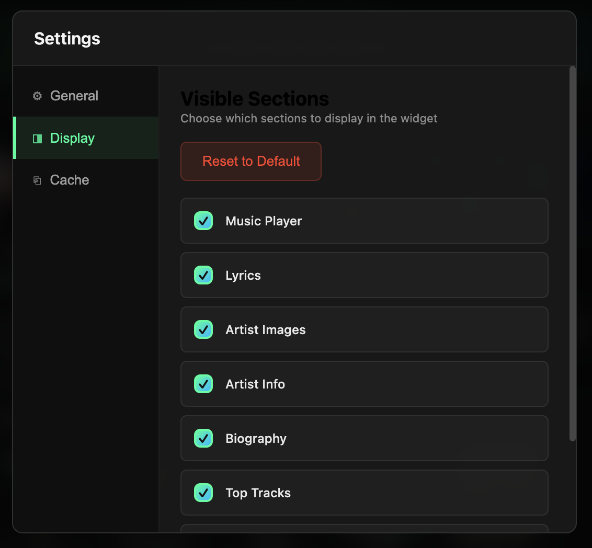

<div align="center">


# LyricGlow

**Real-Time Synchronized Lyrics & Music Metadata for macOS | Spotify • Apple Music • YouTube Music**

Always-on-top lyrics overlay with word-by-word glow effects, artist biography, album covers, and RTL language support (Arabic, Persian, Hebrew). Smart caching, Spotify OAuth, and customizable display.

[](LICENSE)
[](https://www.apple.com/macos)
[](https://www.electronjs.org/)
[](https://github.com/ateymoori/lyricglow/releases)

### 📦 Download Free macOS App

<a href="https://github.com/ateymoori/lyricglow/releases/latest/download/LyricGlow.dmg">
  
</a>

**Free & Open Source** • **macOS 11.0+ Big Sur** • **Apple Silicon M1/M2/M3**

[📥 All Releases](https://github.com/ateymoori/lyricglow/releases) • [🐛 Report Bug](https://github.com/ateymoori/lyricglow/issues) • [✨ Request Feature](https://github.com/ateymoori/lyricglow/issues) • [💬 Discussions](https://github.com/ateymoori/lyricglow/discussions)

</div>

---

## ✨ Key Features

- 🎤 **Synchronized Lyrics Display** - Real-time word-by-word glow effects with LRC format support, perfect for karaoke and sing-along
- 🌍 **RTL Language Support** - Auto-detect and display Arabic lyrics, Persian lyrics, Hebrew lyrics with right-to-left text rendering
- 🎵 **Universal Music Player Support** - Works seamlessly with Spotify, Apple Music, YouTube Music, and any macOS music player via AppleScript
- 🖼️ **Rich Artist Metadata** - Artist photos, biography, discography, top tracks, albums, social media links (Facebook, Twitter, Website)
- 💾 **Smart Offline Caching** - 7-day intelligent cache system for lyrics, metadata, images with automatic offline mode
- 🎨 **Beautiful Dark Theme** - Frameless always-on-top floating window with macOS backdrop blur and transparency effects
- ⚙️ **Fully Customizable** - Toggle visibility for lyrics, images, biography, top tracks, albums, and similar artists sections
- 🔐 **Spotify OAuth Integration** - Secure PKCE authentication for enhanced features like top tracks and albums

---

## 📸 Screenshots - Click to View Full Size

<div align="center">

### Synchronized Lyrics with Real-Time Word Highlighting

<table>
  <tr>
    <td width="33%" align="center">
      <a href="screenshots/lyricglow-synchronized-lyrics-english.png" target="_blank">
        
      </a>
      <br><sub><b>English Synchronized Lyrics</b><br>Real-time word-by-word highlighting</sub>
    </td>
    <td width="33%" align="center">
      <a href="screenshots/lyricglow-synchronized-lyrics-spanish.png" target="_blank">
        
      </a>
      <br><sub><b>Spanish Multilingual Lyrics</b><br>Multi-language support with translations</sub>
    </td>
    <td width="33%" align="center">
      <a href="screenshots/lyricglow-rtl-lyrics-persian.png" target="_blank">
        
      </a>
      <br><sub><b>Persian RTL Lyrics Display</b><br>Right-to-left Arabic/Hebrew support</sub>
    </td>
  </tr>
</table>

### Artist Metadata & Customization Settings

<table>
  <tr>
    <td width="50%" align="center">
      <a href="screenshots/lyricglow-artist-images-album-covers.png" target="_blank">
        
      </a>
      <br><sub><b>Artist Images & Album Covers</b><br>Biography, discography, photos carousel</sub>
    </td>
    <td width="50%" align="center">
      <a href="screenshots/lyricglow-settings-customization.png" target="_blank">
        
      </a>
      <br><sub><b>Customization Settings Panel</b><br>Toggle visibility for any section</sub>
    </td>
  </tr>
</table>

<sup>💡 Click any screenshot above to view full resolution image</sup>

</div>

---

## 📦 Installation Guide

### Option 1: Download Pre-built macOS App (Recommended)

**Quick Install Steps:**

1. **[📥 Download LyricGlow.dmg](https://github.com/ateymoori/lyricglow/releases/latest)** from the latest release
2. **Open DMG File** - Double-click the downloaded `.dmg` file to mount the disk image
3. **Drag to Applications** - Drag LyricGlow icon to your Applications folder
4. **Launch App** - Open from Applications folder or use Spotlight Search (⌘+Space → type "LyricGlow")
5. **Grant Permissions** - Allow macOS automation permissions for Spotify/Apple Music when system prompts

**System Requirements:**
- macOS 11.0 Big Sur or later (macOS 12 Monterey, macOS 13 Ventura, macOS 14 Sonoma supported)
- Apple Silicon (M1/M2/M3 chip) recommended, Intel x86_64 compatible
- 100 MB free disk space
- Active internet connection for lyrics and metadata fetching

### Option 2: Build from Source (For Developers)

**Development Setup:**

```bash
# Clone repository with git
git clone https://github.com/ateymoori/lyricglow.git
cd lyricglow

# Install Node.js dependencies
npm install

# Create environment configuration file
cp .env.example .env
# Optional: Add your Spotify Client ID for enhanced features

# Run in development mode with hot reload
npm start

# Build production DMG installer for macOS
npm run dist:mac

# Build with version bump and release notes
npm run release
```

**Developer Tools:**
- Node.js 16+ and npm required
- Xcode Command Line Tools for macOS code signing
- Spotify Developer Account (optional, for API features)

---

## 🚀 Usage Guide

### Quick Start Tutorial

1. **Play Music** - Start playing any track in Spotify, Apple Music, YouTube Music, or your preferred macOS music player
2. **View Synchronized Lyrics** - LyricGlow automatically detects now playing track and displays real-time synchronized lyrics with word-by-word glow effects
3. **Customize Display** - Click ⚙️ Settings icon (top-right) to toggle visibility for lyrics, images, biography, top tracks, albums sections
4. **Spotify OAuth Login** (Optional) - Click "Login with Spotify" in Settings → General tab to unlock Top Tracks and Top Albums features via secure OAuth authentication
5. **Use Menu Bar Icon** - Click LyricGlow tray icon in macOS menu bar to quickly show/hide the floating lyrics window

### Pro Tips & Keyboard Shortcuts

- **Seek Playback** - Click anywhere on the progress bar to jump to that timestamp in the current track
- **Open in Spotify** - Click album artwork to open the currently playing track in Spotify desktop app or web player
- **Reposition Window** - Click and drag anywhere on the window (outside buttons/clickable elements) to reposition the floating overlay
- **Toggle Always-On-Top** - Window stays above all other apps by default for continuous lyrics viewing
- **Cache Management** - Settings → Cache tab to view cached lyrics, clear old data, manage storage

---

## 🛠️ Development & Contributing

### Available NPM Scripts

```bash
npm start              # Launch Electron app in development mode
npm run dev            # Launch with debug console logging enabled
npm run dist:mac       # Build production DMG for macOS Apple Silicon
npm run pack           # Package app without creating installer (for testing)
npm run release        # Auto bump version, build DMG, generate release notes
```

### Tech Stack & Architecture

**Frontend:**
- **Electron 33** - Cross-platform desktop framework with Chromium + Node.js
- **HTML5 + CSS3** - Native web technologies for UI rendering
- **JavaScript ES6+** - Modern async/await patterns

**Backend APIs:**
- **AppleScript** - macOS native music player integration for Spotify, Apple Music, YouTube Music
- **LRCLIB API** - Free open-source synchronized lyrics database with LRC format support
- **TheAudioDB API** - Artist metadata, biography, discography, images, social links
- **Spotify Web API** - OAuth authentication, top tracks, top albums, enhanced metadata

**Data & Storage:**
- **electron-store** - Encrypted persistent storage for settings and OAuth tokens
- **Unified Cache System** - SHA256 hashing, 7-day TTL, automatic cleanup, offline mode

---

## 🗺️ Roadmap & Future Features

**v0.2** - AI & LLM Integration, MCP server support, Genius API fallback, Last.fm scrobbling, ChatGPT lyrics analysis, Claude AI recommendations, mini compact mode

**v0.3** - UI translations (20+ languages), side-by-side multilingual lyrics, romanization for Chinese/Japanese/Korean, more lyrics sources (Musixmatch, LyricsGenius, QQ Music)

**v0.4** - Windows support (Media Control API), Linux support (MPRIS protocol), Android/iOS mobile companion apps, web browser extension, cross-platform synchronization

**v0.5** - AI-powered karaoke mode, custom color themes, global keyboard shortcuts, lyrics export to LRC files, floating transparent overlay, MCP (Model Context Protocol) server integration, LLM-powered song recommendations

**AI & Machine Learning Features:**
- GPT-4 powered lyrics analysis and meaning interpretation
- Claude AI song recommendations based on listening history
- Local LLM integration for offline lyrics generation
- MCP server protocol for AI assistant integration
- Machine learning lyrics correction and quality improvement
- Sentiment analysis and mood detection with AI
- Neural network-based similar songs discovery

---

## 🔑 Configuration & Setup

### Spotify API Configuration (Optional)

**Enable Top Tracks & Albums features:**

1. Visit [Spotify Developer Dashboard](https://developer.spotify.com/dashboard) and login with your Spotify account
2. Click **"Create App"** button to register a new application
3. Fill in application details:
   - **App Name:** LyricGlow (or any name you prefer)
   - **App Description:** Personal music lyrics display application
   - **Redirect URI:** `musicdisplay://callback` (copy exactly as shown)
   - **API Type:** Web API
4. Click **"Save"** and copy your **Client ID** from the dashboard
5. Open `.env` file in project root and add your Client ID:

```env
# Spotify OAuth (optional - for Top Tracks/Albums features)
SPOTIFY_CLIENT_ID=your_spotify_client_id_here

# TheAudioDB (free public key - already included)
AUDIODB_API_KEY=523532

# Cache configuration
CACHE_DURATION_HOURS=168  # 7 days default
MAX_ARTIST_IMAGES=8
MAX_TOP_TRACKS=5
MAX_TOP_ALBUMS=4
```

---

## 🤝 Contributing to LyricGlow

**We welcome contributions from developers worldwide!**

### How to Contribute

1. **Fork Repository** - Click Fork button on GitHub to create your copy
2. **Clone Your Fork** - `git clone https://github.com/yourusername/lyricglow.git`
3. **Create Feature Branch** - `git checkout -b feature/amazing-lyrics-feature`
4. **Make Changes** - Implement your feature or bug fix with clear code
5. **Commit Changes** - `git commit -m 'feat: add amazing lyrics feature'`
6. **Push Branch** - `git push origin feature/amazing-lyrics-feature`
7. **Open Pull Request** - Submit PR with detailed description of changes

### Areas We Need Help With

- 🪟 **Windows Support** - Media Control API integration for Windows 10/11
- 🐧 **Linux Support** - MPRIS D-Bus protocol implementation for Ubuntu/Fedora
- 🌍 **Translations** - UI localization for Spanish, French, German, Chinese, Japanese, Korean languages
- 🎤 **Lyrics APIs** - Integration with Musixmatch, Genius, LyricsGenius, AZLyrics
- 🎨 **UI/UX Design** - Modern interface improvements, light theme, custom color schemes
- 📱 **Mobile Apps** - React Native iOS/Android companion apps
- 📖 **Documentation** - Tutorial videos, user guides, API documentation
- 🐛 **Bug Fixes** - Testing on different macOS versions, fixing edge cases
- 🤖 **AI Integration** - GPT/Claude integration, MCP server, LLM-powered features

### Code Style Guidelines

- Use ES6+ modern JavaScript syntax
- Follow existing code formatting patterns
- Add JSDoc comments for functions
- Write meaningful commit messages (feat/fix/docs/refactor)
- Test on macOS before submitting PR

---

## 📄 License

MIT License - Copyright (c) 2025 AmirHossein Teymoori

Free to use, modify, and distribute. See [LICENSE](LICENSE) for details.

---

## 🙏 Credits & Acknowledgments

### APIs & Services

- **[LRCLIB](https://lrclib.net/)** - Open-source synchronized lyrics database with free API access and LRC format support
- **[TheAudioDB](https://www.theaudiodb.com/)** - Comprehensive music database with artist metadata, biography, discography, and high-quality images
- **[Spotify Web API](https://developer.spotify.com/)** - Official Spotify API for music metadata, top tracks, albums, and OAuth authentication

### Technologies & Frameworks

- **[Electron](https://www.electronjs.org/)** - Cross-platform desktop application framework built on Chromium and Node.js
- **[electron-store](https://github.com/sindresorhus/electron-store)** - Simple data persistence and encrypted storage for Electron apps
- **[electron-builder](https://www.electron.build/)** - Complete solution to package and build Electron apps for macOS, Windows, Linux

### Inspiration & Similar Projects

Inspired by Musixmatch Desktop, Genius Desktop, Apple Music Lyrics, Spotify Lyrics, and the open-source music community.

---

<div align="center">

## 👨‍💻 Created By

**[AmirHossein Teymoori](https://github.com/ateymoori)**

Software Engineer & Open Source Contributor

📧 [Teymoori.net@gmail.com](mailto:Teymoori.net@gmail.com)  
🐙 [GitHub @ateymoori](https://github.com/ateymoori)

---

### ⭐ Support This Project

**If you find LyricGlow useful, please star this repository!**

⭐ **[Star on GitHub](https://github.com/ateymoori/lyricglow)** ⭐

---

### 🔍 Search Keywords

synchronized lyrics app • real-time lyrics display • spotify lyrics overlay • apple music lyrics viewer • youtube music lyrics • music metadata app • album artwork display • artist biography viewer • rtl lyrics support • persian lyrics app • arabic lyrics display • hebrew lyrics • multilingual lyrics • karaoke lyrics app • desktop lyrics player • electron music app • macos music widget • now playing overlay • lyrics synchronization • music companion app • song lyrics viewer • live lyrics display • genius lyrics alternative • musixmatch desktop • lyrics desktop application • free lyrics app • open source music player • macos lyrics widget • floating lyrics window • transparent lyrics overlay • music visualization • artist discography viewer • album covers display • spotify desktop companion • apple music companion • youtube music desktop • lrc lyrics player • synchronized karaoke • lyrics timing display • music metadata viewer • audio player companion • track info display • now playing widget • music control widget • lyrics automation • ai lyrics analysis • llm music recommendations • chatgpt lyrics • claude ai music • mcp server integration • machine learning lyrics • gpt-4 music analysis • ai song recommendations • neural network music • deep learning lyrics

</div>
