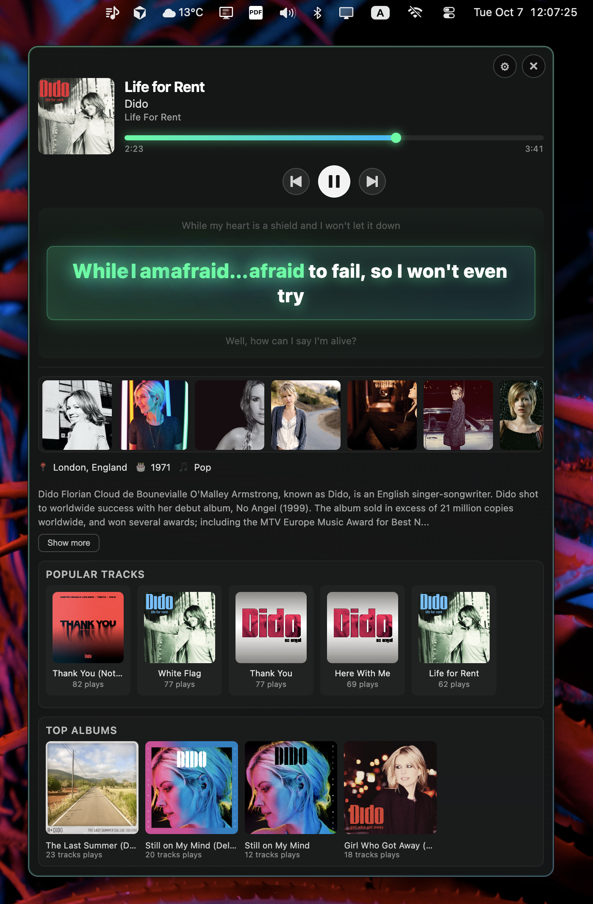
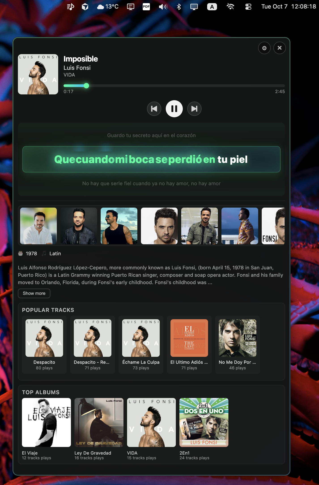
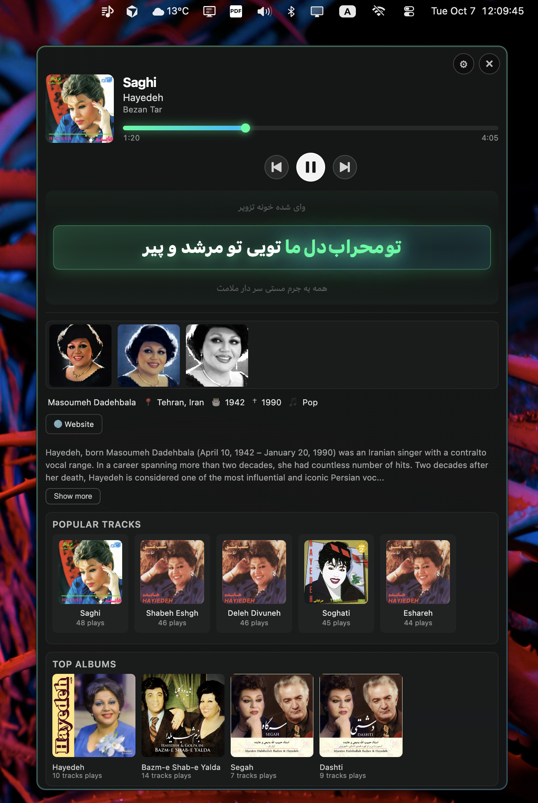

<div align="center">


# LyricGlow

### Real-Time Synchronized Lyrics for macOS

Experience music like never before with word-by-word synchronized lyrics, artist insights, and beautiful album artwork. Works seamlessly with Spotify, Apple Music, and YouTube Music.

[](LICENSE)
[](https://www.apple.com/macos)
[](https://www.electronjs.org/)
[](https://github.com/ateymoori/lyricglow/releases)

### 📦 Download Free

<a href="https://github.com/ateymoori/lyricglow/releases/latest/download/LyricGlow.dmg">
  
</a>

**Free & Open Source** • **Apple Silicon & Intel** • **macOS 11+**

[All Releases](https://github.com/ateymoori/lyricglow/releases) • [Report Bug](https://github.com/ateymoori/lyricglow/issues) • [Discussions](https://github.com/ateymoori/lyricglow/discussions)

</div>

---

## ✨ Features

🎤 **Synchronized Lyrics** - Real-time word-by-word highlighting with smooth animations

🌍 **RTL Support** - Perfect display for Arabic, Persian, and Hebrew lyrics

🎵 **Universal Compatibility** - Works with Spotify, Apple Music, YouTube Music, and more

🖼️ **Rich Metadata** - Artist photos, biography, top tracks, and album covers

💾 **Smart Caching** - 7-day intelligent cache for offline playback

🎨 **Beautiful Design** - Dark theme with backdrop blur and always-on-top window

⚙️ **Fully Customizable** - Show or hide any section to match your preference

🔐 **Spotify Integration** - Optional OAuth login for enhanced features

---

## 📸 Screenshots

<div align="center">

<table>
  <tr>
    <td width="33%" align="center">
      
      <br><sub><b>English Lyrics</b></sub>
    </td>
    <td width="33%" align="center">
      
      <br><sub><b>Multilingual Support</b></sub>
    </td>
    <td width="33%" align="center">
      
      <br><sub><b>RTL Languages</b></sub>
    </td>
  </tr>
</table>

</div>

---

## 📦 Installation

### Quick Install

1. [Download LyricGlow.dmg](https://github.com/ateymoori/lyricglow/releases/latest)
2. Open the DMG file
3. Drag to Applications folder
4. Launch and enjoy

**Requirements:**
- macOS 11.0 or later
- 100 MB free space
- Internet connection for lyrics

### Build from Source

```bash
git clone https://github.com/ateymoori/lyricglow.git
cd lyricglow
npm install
npm start
npm run dist:mac
```

---

## 🚀 Usage

1. **Play Music** - Start any track in your music player
2. **View Lyrics** - LyricGlow automatically displays synchronized lyrics
3. **Customize** - Click ⚙️ to toggle sections visibility
4. **Spotify Login** (Optional) - Unlock top tracks and albums features
5. **Menu Bar** - Use tray icon to show/hide window

**Tips:**
- Click progress bar to seek
- Drag window anywhere to reposition
- Click artwork to open in Spotify
- Settings → Cache to manage storage

---

## 🛠️ Development

### NPM Scripts

```bash
npm start          # Development mode
npm run dev        # With debug logging
npm run dist:mac   # Build DMG
npm run release    # Version bump + build
```

### Tech Stack

- **Electron 33** - Desktop framework
- **AppleScript** - Music player integration
- **LRCLIB API** - Synchronized lyrics database
- **TheAudioDB** - Artist metadata
- **Spotify API** - OAuth and enhanced features

---

## 🗺️ Roadmap

**v0.3** - Multilingual UI, more lyrics sources, romanization

**v0.4** - Windows & Linux support, mobile apps, browser extension

**v0.5** - AI features, custom themes, keyboard shortcuts, karaoke mode

---

## 🤝 Contributing

Contributions welcome! Areas we need help:

- 🪟 Windows support
- 🐧 Linux support
- 🌍 UI translations
- 🎤 Additional lyrics sources
- 🎨 UI/UX improvements
- 📖 Documentation

**How to contribute:**
1. Fork repository
2. Create feature branch
3. Commit changes
4. Push to branch
5. Open pull request

---

## 📄 License

MIT License - Copyright (c) 2025 AmirHossein Teymoori

Free to use, modify, and distribute.

---

## 🙏 Credits

**APIs:** [LRCLIB](https://lrclib.net/) • [TheAudioDB](https://www.theaudiodb.com/) • [Spotify](https://developer.spotify.com/)

**Frameworks:** [Electron](https://www.electronjs.org/) • [electron-store](https://github.com/sindresorhus/electron-store) • [electron-builder](https://www.electron.build/)

---

<div align="center">

## 👨‍💻 Created By

**[AmirHossein Teymoori](https://github.com/ateymoori)**

📧 [Teymoori.net@gmail.com](mailto:Teymoori.net@gmail.com)
🐙 [GitHub @ateymoori](https://github.com/ateymoori)

---

### ⭐ Star This Project

If you find LyricGlow useful, please star this repository!

[](https://github.com/ateymoori/lyricglow)

---

### 🔍 Keywords

synchronized lyrics • real-time lyrics • spotify lyrics • apple music lyrics • youtube music lyrics • karaoke app • lyrics display • macos lyrics • electron music app • music metadata • album artwork • artist biography • rtl lyrics • arabic lyrics • persian lyrics • hebrew lyrics • multilingual lyrics • music player overlay • now playing • desktop lyrics • lyrics widget • floating lyrics • transparent overlay • music companion • lyrics synchronization • lrc format • music visualization • spotify companion • apple music companion • free lyrics app • open source music • lyrics automation • music widget

</div>
