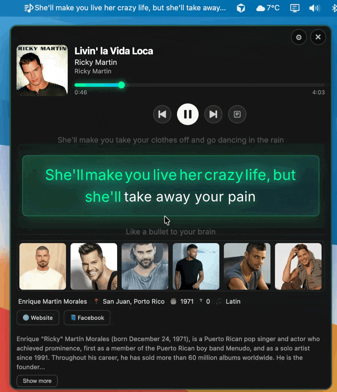
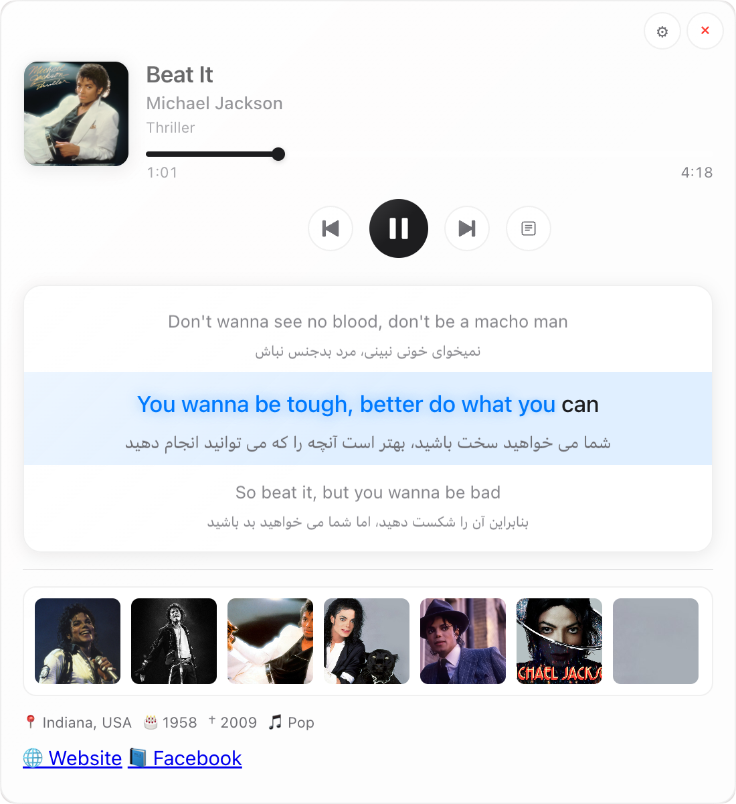
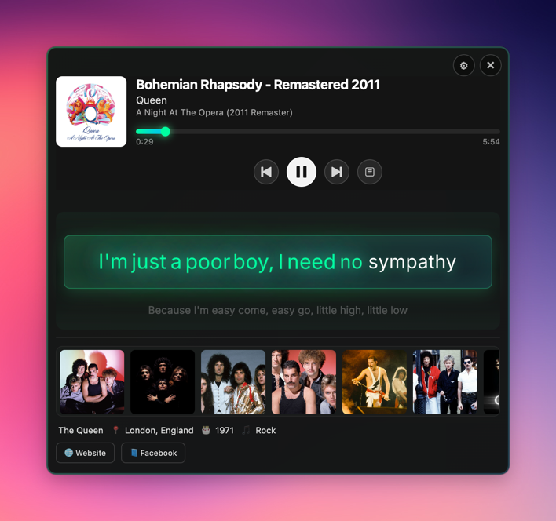
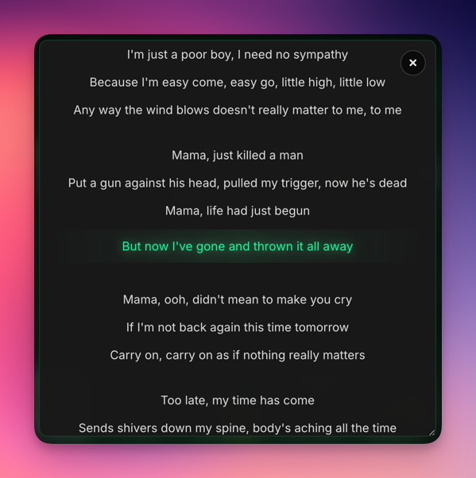
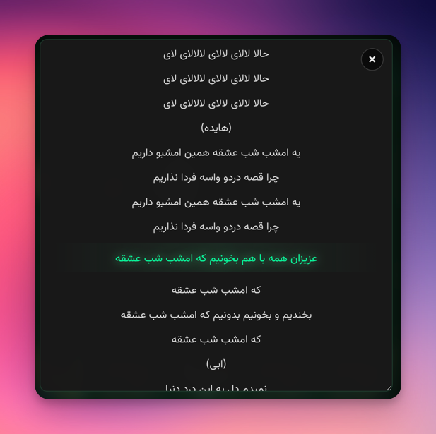

<div align="center">

<!-- Logo & Title -->


# LyricGlow

### Real-Time Synchronized Lyrics for macOS

Word-by-word lyrics highlighting for Spotify, Apple Music, and any macOS music player.

<!-- Primary Badges -->
<p>
  <a href="https://github.com/ateymoori/lyricglow/actions/workflows/ci.yml">
    
  </a>
  <a href="https://github.com/ateymoori/lyricglow/releases">
    
  </a>
  <a href="https://github.com/ateymoori/lyricglow/releases">
    
  </a>
  <a href="LICENSE">
    
  </a>
</p>

<!-- Tech Badges -->
<p>
  
  
  
  
</p>

<!-- Demo GIF -->
<br>

<br>
<sub>Real-time synchronized lyrics with word-by-word highlighting</sub>

</div>

<br>

## Quick Install

```bash
curl -fsSL https://raw.githubusercontent.com/ateymoori/lyricglow/main/scripts/install.sh | bash
```

> **Supports:** Apple Silicon (M1/M2/M3/M4) and Intel Macs • macOS 11.0+

<details>
<summary><strong>Manual Installation</strong></summary>
<br>

1. Download from [Releases](https://github.com/ateymoori/lyricglow/releases):
   - **Apple Silicon:** `LyricGlow-arm64.dmg`
   - **Intel:** `LyricGlow-x64.dmg`
2. Open DMG → Drag to Applications
3. First launch: Right-click → Open

</details>

<br>

## Features

<table>
<tr>
<td>

**Core**
- Real-time word-by-word highlighting
- Auto-sync with playback position
- Full lyrics modal view
- Progress bar seek support

</td>
<td>

**Integrations**
- Spotify, Apple Music, YouTube Music
- Spotify OAuth for top tracks/albums
- Menu bar live lyrics display
- 7-day intelligent caching

</td>
<td>

**Design**
- Glassmorphism UI
- RTL support (Arabic, Persian, Hebrew)
- Customizable sections
- Always-on-top floating window

</td>
</tr>
</table>

<br>

## Screenshots

<div align="center">
<table>
<tr>
<td align="center"><br><strong>Full Mode</strong></td>
<td align="center"><br><strong>Compact Mode</strong></td>
</tr>
<tr>
<td align="center"><br><strong>Lyrics Only</strong></td>
<td align="center"><br><strong>RTL Support</strong></td>
</tr>
</table>


<br>
<sub>Menu Bar Integration</sub>
</div>

<br>

## Usage

1. **Launch** LyricGlow from Applications
2. **Play** music in any supported player
3. **Watch** lyrics sync with word-by-word glow
4. **Customize** via settings (gear icon)

| Shortcut | Action |
|----------|--------|
| `Cmd+L` | Toggle window |
| Click progress bar | Seek to position |
| Click album art | Open in Spotify |

<br>

## Development

```bash
git clone https://github.com/ateymoori/lyricglow.git && cd lyricglow
npm install
npm run dev      # Development with hot reload
npm run build    # Compile TypeScript
npm run dist     # Build DMG
```

<details>
<summary><strong>Project Structure</strong></summary>

```
src/
├── main/           # Electron main process
│   ├── auth/       # Spotify OAuth
│   └── managers/   # Lyrics, metadata, cache
├── preload/        # IPC bridge
├── renderer/       # UI (DOM manipulation)
└── shared/         # Types, utilities, logger
```

</details>

<br>

## Contributing

PRs welcome! Priority areas:

- Windows/Linux support
- Additional lyrics sources
- UI translations

<br>

## Credits

| Service | Purpose |
|---------|---------|
| [LRCLIB](https://lrclib.net/) | Synchronized lyrics |
| [TheAudioDB](https://www.theaudiodb.com/) | Artist metadata |
| [Spotify API](https://developer.spotify.com/) | Top tracks & albums |

<br>

---

<div align="center">

**MIT License** © [AmirHossein Teymoori](https://github.com/ateymoori)

<p>
  <a href="https://github.com/ateymoori/lyricglow/issues">Report Bug</a>
  •
  <a href="https://github.com/ateymoori/lyricglow/issues">Request Feature</a>
  •
  <a href="https://github.com/ateymoori/lyricglow/releases">Releases</a>
</p>

<br>

**If you find LyricGlow useful, consider giving it a ⭐**

</div>
