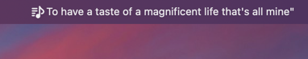
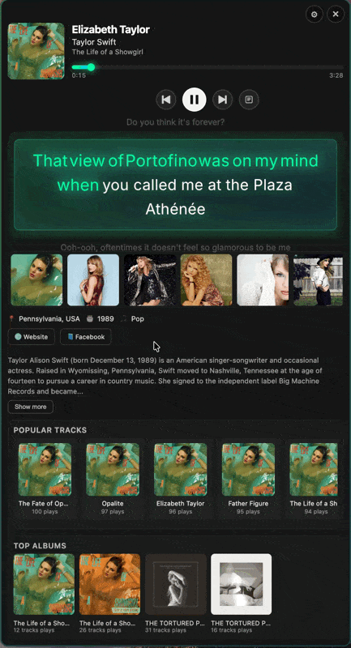

<div align="center">


# LyricGlow

### **Real-Time Synchronized Lyrics & Music Metadata for macOS**

Experience your music like never before with **word-by-word synchronized lyrics**, rich artist metadata, and beautiful album artwork. A floating, always-on-top companion for Spotify, Apple Music, and YouTube Music.

[](LICENSE)
[](#)
[](https://github.com/ateymoori/lyricglow/releases)
[](https://www.apple.com/macos)
[](https://www.electronjs.org/)

**🆓 Free & Open Source** • **🍎 Apple Silicon & Intel** • **⚡ Fast & Lightweight** • **🔒 Privacy-First**

[Features](#-features) • [Screenshots](#-screenshots) • [Installation](#-installation) • [Usage](#-usage) • [Development](#-development)

---


<sub>**Real-time synchronized lyrics with smooth word-by-word highlighting and rich metadata**</sub>

</div>

---

## ✨ Features

<table>
<tr>
<td width="50%">

### 🎤 **Synchronized Lyrics**
- **Word-by-word highlighting** with smooth animations
- **3-line display** (previous, current, next)
- **Full lyrics modal** for complete song view
- **Auto-scroll** synchronized with playback
- **Instant lyrics fetching** from LRCLIB database

### 🌍 **RTL Language Support**
- **Perfect RTL rendering** for Arabic, Persian, Hebrew
- **Bidirectional text handling**
- **Font optimization** for multilingual lyrics
- **Automatic language detection**

### 🎵 **Universal Music Player Support**
- **Spotify** - Full integration with OAuth
- **Apple Music** - Native macOS integration
- **YouTube Music** - Browser-based detection
- **Works with any macOS media player** using Now Playing API

### 🖼️ **Rich Artist Metadata**
- **Artist biography** with expand/collapse
- **Image carousel** with multiple photos
- **Similar artists** discovery
- **Social media links** (Website, Facebook, Twitter)
- **Artist statistics** (listeners, play counts)

</td>
<td width="50%">

### 🎨 **Beautiful Design**
- **Glass morphism UI** with backdrop blur
- **Dark theme** optimized for readability
- **Always-on-top** floating window
- **Frameless design** with drag support
- **Smooth animations** and transitions

### ⚙️ **Fully Customizable**
- **Toggle any section** (player, lyrics, metadata)
- **Compact mode** for minimal UI
- **Lyrics-only mode** for focused reading
- **Adjustable window position**
- **Launch at login** option

### 🔐 **Spotify Integration**
- **OAuth 2.0 authentication** (secure)
- **Top tracks** from artist's catalog
- **Top albums** with artwork
- **User profile** display
- **Enhanced metadata** from Spotify API

### 💾 **Smart Performance**
- **7-day intelligent caching** for lyrics & metadata
- **Offline playback** support
- **Image optimization** with local cache
- **Low memory footprint** (~80-150MB RAM)
- **Efficient polling** (500ms-1s intervals)
- **Battery-friendly** background processing

</td>
</tr>
</table>

---

## 📸 Screenshots

<div align="center">

### **Display Modes**

<table>
<tr>
<td width="50%" align="center">

<br><br>
<b>Full Mode</b>
<br><sub>Complete experience with all features enabled</sub>
</td>
<td width="50%" align="center">

<br><br>
<b>Compact Mode</b>
<br><sub>Essential player controls and lyrics</sub>
</td>
</tr>
</table>

---

### **Lyrics Display Options**

<table>
<tr>
<td width="50%" align="center">

<br><br>
<b>Lyrics-Only Mode</b>
<br><sub>Distraction-free focused reading</sub>
</td>
<td width="50%" align="center">

<br><br>
<b>RTL Language Support</b>
<br><sub>Perfect rendering for Arabic, Persian, Hebrew</sub>
</td>
</tr>
</table>

---

### **Menu Bar Integration**

<table>
<tr>
<td width="50%" align="center">

<br><br>
<b>Live Lyrics in Menu Bar</b>
<br><sub>Real-time animated updates</sub>
</td>
<td width="50%" align="center">

<br><br>
<b>Menu Bar Static View</b>
<br><sub>Current lyric line display</sub>
</td>
</tr>
</table>

---

### **See It In Action**



<sub>Smooth synchronized lyrics animation with word-by-word highlighting</sub>

</div>

---

## 📦 Installation

### **Quick Install (Recommended)**

#### **For Apple Silicon Macs (M1, M2, M3, M4)**
1. **Download LyricGlow-arm64.dmg** from the latest release
2. Open the DMG file
3. Drag **LyricGlow.app** to `/Applications` folder
4. **Right-click** LyricGlow → Select **"Open"**
5. Click **"Open"** in the security dialog

#### **For Intel Macs**
1. **Download LyricGlow-x64.dmg** from the latest release
2. Follow steps 2-5 above

> ⚠️ **First Launch Security Note:** macOS Gatekeeper will show a warning because LyricGlow uses ad-hoc signing (not notarized). Right-clicking and selecting "Open" bypasses this check. This is required only on first launch.

**System Requirements:**
- macOS 11.0 (Big Sur) or later
- 100 MB free disk space
- Internet connection for lyrics fetching
- Spotify, Apple Music, or any music player using macOS Now Playing API

### **Build from Source**

```bash
# Clone repository
git clone https://github.com/ateymoori/lyricglow.git
cd lyricglow

# Install dependencies
npm install

# Run in development mode
npm start

# Build DMG for distribution
npm run dist:mac
```

**Developer Requirements:**
- Node.js 22.x or later
- npm or yarn
- Xcode Command Line Tools

---

## 🚀 Usage

### **Getting Started**

1. **Launch LyricGlow** - The app will appear as a floating window
2. **Play music** in Spotify, Apple Music, or YouTube Music
3. **Watch lyrics sync** automatically with word-by-word highlighting
4. **Customize your experience** - Click ⚙️ to open settings

### **Features Guide**

#### **Media Controls**
- **Play/Pause** - Click the center button or spacebar
- **Skip tracks** - Use previous/next buttons
- **Seek** - Click or drag the progress bar to jump to any timestamp
- **Full lyrics** - Click 📄 button to view complete lyrics

#### **Settings & Customization**

<details>
<summary><b>🎛️ General Settings</b></summary>

- **Launch at Login** - Auto-start LyricGlow when you log in
- **Menu Bar Lyrics** - Display current lyric line in system tray
- **Spotify Integration** - Connect your account for enhanced features

</details>

<details>
<summary><b>🎨 Display Settings</b></summary>

Toggle visibility for each section:
- ✅ Music Player (album art, controls, progress bar)
- ✅ Synchronized Lyrics
- ✅ Artist Images Carousel
- ✅ Artist Biography
- ✅ Artist Metadata (country, genre, social links)
- ✅ Top Tracks (Spotify login required)
- ✅ Top Albums (Spotify login required)
- ✅ Similar Artists

</details>

<details>
<summary><b>💾 Cache Management</b></summary>

- **View cached items** - See all stored lyrics, metadata, and images
- **Clear individual items** - Remove specific cached songs
- **Clear all cache** - Fresh start (7-day auto-cleanup by default)

</details>

<details>
<summary><b>📊 Logs & Troubleshooting</b></summary>

- **View log statistics** - Monitor app performance
- **Open logs folder** - Access detailed logs at `~/Library/Logs/LyricGlow/`
- **Clear logs** - Remove old log files

</details>

### **Pro Tips**

💡 **Drag to reposition** - Click and drag anywhere on the window
💡 **Click album art** - Opens track in Spotify (if installed)
💡 **Menu bar control** - Right-click tray icon for quick actions
💡 **Keyboard shortcuts** - Spacebar for play/pause (when focused)
💡 **RTL support** - Automatically detected for Arabic, Persian, Hebrew

---

## 🛠️ Development

### **Project Structure**

```
lyricglow/
├── app/                        # Main application code
│   ├── main.js                # Electron main process
│   ├── renderer.js            # UI logic & event handling
│   ├── preload.js             # Secure IPC bridge
│   ├── index.html             # Main window markup
│   ├── styles.css             # Complete styling
│   ├── auth/                  # Spotify OAuth
│   ├── cache/                 # Caching system
│   ├── lyrics/                # Lyrics fetching (LRCLIB)
│   ├── metadata/              # Artist metadata (TheAudioDB, Spotify)
│   └── utils/                 # Logger, SecureFetch
├── build/                     # Build assets (icons, entitlements)
├── assets/fonts/              # Embedded fonts (Inter, Vazirmatn)
└── electron-builder.yml       # Packaging configuration
```

### **NPM Scripts**

```bash
npm start              # Launch app (production mode)
npm run dev            # Launch with verbose logging
npm run pack           # Build unpacked app for testing
npm run dist:mac       # Build DMG for macOS (both architectures)
npm run release        # Auto version bump + build
```

### **Tech Stack**

| Category | Technology |
|----------|-----------|
| **Framework** | [Electron 33.4.11](https://www.electronjs.org/) |
| **Language** | TypeScript 5.9.3 (Strict Mode) |
| **Build System** | [electron-vite](https://electron-vite.org/) + [Vite 5.4.21](https://vitejs.dev/) |
| **Lyrics API** | [LRCLIB](https://lrclib.net/) - Synchronized lyrics database |
| **Metadata API** | [TheAudioDB](https://www.theaudiodb.com/) - Artist information |
| **Music Integration** | [Spotify Web API](https://developer.spotify.com/) - OAuth & enhanced features |
| **System Integration** | macOS AppleScript, Now Playing API |
| **Storage** | [electron-store](https://github.com/sindresorhus/electron-store) |
| **Logging** | [electron-log](https://github.com/megahertz/electron-log) |
| **Packaging** | [electron-builder](https://www.electron.build/) |

### **Architecture Highlights**

- **Security-First:** Context isolation, no Node.js integration in renderer, CSP headers
- **Event-Driven:** IPC communication between main and renderer processes
- **Efficient Polling:** Smart interval adjustments (500ms-1s) based on playback state
- **Multi-Source:** Lyrics from LRCLIB, metadata from TheAudioDB and Spotify
- **Offline Support:** 7-day intelligent caching with automatic cleanup

---

## 🗺️ Roadmap

### **v0.4 - Enhanced Experience** (Q1 2025)
- [ ] Multilingual UI (Spanish, French, German, Persian, Arabic, Chinese)
- [ ] Additional lyrics sources (Genius, Musixmatch fallback)
- [ ] Romanization for non-Latin scripts
- [ ] Customizable themes and colors
- [ ] Keyboard shortcuts configuration

### **v0.5 - Cross-Platform** (Q2 2025)
- [ ] Windows 10/11 support
- [ ] Linux (Ubuntu, Fedora) support
- [ ] Chrome/Firefox browser extension
- [ ] iOS companion app (view lyrics on mobile)

### **v1.0 - AI & Advanced Features** (Q3 2025)
- [ ] AI-powered lyrics generation for missing songs
- [ ] Karaoke mode with vocal removal
- [ ] Lyrics translation (50+ languages)
- [ ] Music recommendations based on lyrics mood
- [ ] Export lyrics with timestamps
- [ ] Animated backgrounds sync to music

---

## 🤝 Contributing

We welcome contributions! Here's how you can help:

### **High Priority**
- 🪟 **Windows Support** - Port to Windows 10/11 with native APIs
- 🐧 **Linux Support** - MPRIS integration for Ubuntu/Fedora
- 🌍 **UI Translations** - Localize interface to your language
- 🎤 **Lyrics Sources** - Integrate additional APIs (Genius, Musixmatch)

### **Also Needed**
- 🎨 UI/UX improvements
- 📖 Documentation & tutorials
- 🐛 Bug reports & testing
- 💡 Feature suggestions

### **How to Contribute**

1. **Fork** this repository
2. **Clone** your fork: `git clone https://github.com/YOUR_USERNAME/lyricglow.git`
3. **Create branch**: `git checkout -b feature/your-feature-name`
4. **Make changes** and commit: `git commit -m "Add: your feature description"`
5. **Push** to your fork: `git push origin feature/your-feature-name`
6. **Open Pull Request** with detailed description

**Development Guidelines:**
- Follow existing code style (ES2022, async/await)
- Test on both Apple Silicon and Intel Macs
- Update README for new features
- Add error handling and logging

---

## 📄 License

**MIT License** - Copyright (c) 2025 AmirHossein Teymoori

Permission is hereby granted, free of charge, to use, modify, and distribute this software.

See [LICENSE](LICENSE) file for full details.

---

## 🙏 Credits & Acknowledgments

### **APIs & Services**
- [**LRCLIB**](https://lrclib.net/) - Free synchronized lyrics database
- [**TheAudioDB**](https://www.theaudiodb.com/) - Artist metadata and biography
- [**Spotify Web API**](https://developer.spotify.com/) - Music metadata and OAuth

### **Technologies**
- [**Electron**](https://www.electronjs.org/) - Cross-platform desktop framework
- [**electron-store**](https://github.com/sindresorhus/electron-store) - Settings persistence
- [**electron-builder**](https://www.electron.build/) - macOS packaging and DMG creation
- [**electron-log**](https://github.com/megahertz/electron-log) - Logging system

### **Fonts**
- [**Inter**](https://rsms.me/inter/) - UI font for Latin scripts
- [**Vazirmatn**](https://github.com/rastikerdar/vazirmatn) - Persian/Arabic font

---

<div align="center">

## 👨‍💻 Developer


**[AmirHossein Teymoori](https://github.com/ateymoori)**

Senior Full-Stack Developer & Open Source Enthusiast

[](https://github.com/ateymoori)
[](mailto:Teymoori.net@gmail.com)

---

## ⭐ Support This Project

If LyricGlow enhances your music experience, please consider:

<p>
  <a href="https://github.com/ateymoori/lyricglow">
    
  </a>
</p>

**Star this repository** • **Share with friends** • **Report bugs** • **Contribute code**

Every star helps more people discover LyricGlow! 🌟

---

## 🔗 Links

[**🏠 GitHub Repository**](https://github.com/ateymoori/lyricglow) •
[**📦 Build from Source**](#build-from-source) •
[**🐛 Report Issues**](https://github.com/ateymoori/lyricglow/issues)

---

## 🏷️ Keywords & Topics

`synchronized-lyrics` `real-time-lyrics` `spotify-lyrics` `apple-music-lyrics` `youtube-music-lyrics` `macos-app` `electron-app` `music-player` `lyrics-display` `now-playing` `desktop-lyrics` `floating-widget` `lyrics-widget` `music-companion` `karaoke` `rtl-support` `arabic-lyrics` `persian-lyrics` `hebrew-lyrics` `multilingual` `music-metadata` `artist-biography` `album-artwork` `spotify-integration` `free-app` `open-source` `mit-license` `electron` `typescript` `macos-big-sur` `apple-silicon` `m1-m2-m3` `lyrics-automation` `lyrics-synchronization` `lrc-format` `music-visualization` `transparent-overlay` `always-on-top` `music-widget` `desktop-widget` `lyrics-api`

---

<sub>Made with ❤️ for music lovers | Last updated: October 2025 | Version 0.4.0</sub>

</div>
