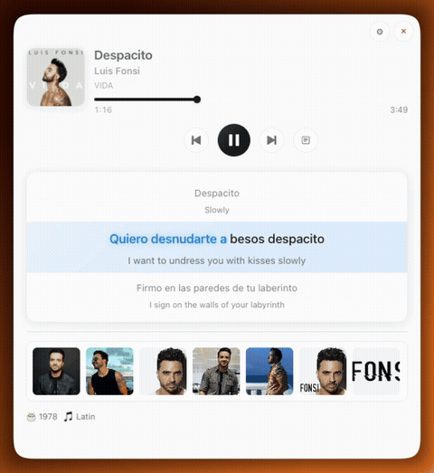

<div align="center">


# LyricGlow

### Real-Time Synced Lyrics for Spotify & Apple Music — in Your macOS Menu Bar

Karaoke-style word-by-word lyrics in a floating Liquid Glass window and live in the menu bar,
with built-in translation into 43 languages. Free, open source, no account needed.

<p>
  <a href="https://github.com/ateymoori/lyricglow/actions/workflows/ci.yml"></a>
  <a href="https://github.com/ateymoori/lyricglow/releases"></a>
  <a href="https://github.com/ateymoori/lyricglow/releases"></a>
  <a href="LICENSE"></a>
  
</p>

<br>

<table>
<tr>
<td align="center"><br><sub>Word-by-word glow · live Persian translation</sub></td>
<td align="center"><br><sub>Despacito — Spanish lyrics · live English translation</sub></td>
</tr>
</table>

🎬 **Full promo videos:**
[Spanish → English (Despacito)](https://github.com/ateymoori/lyricglow/releases/download/v0.7.0/lyricglow-promo-es.mp4) ·
[English → Persian (Beat It)](https://github.com/ateymoori/lyricglow/releases/download/v0.7.0/lyricglow-promo-fa.mp4)

<br>

```bash
brew install --cask ateymoori/tap/lyricglow
```

</div>

<br>

## Install

**Homebrew** (recommended — signed & notarized, zero warnings):

```bash
brew install --cask ateymoori/tap/lyricglow
```

**One-line installer** (no Homebrew needed):

```bash
curl -fsSL https://raw.githubusercontent.com/ateymoori/lyricglow/main/scripts/install.sh | bash
```

> **Runs on:** macOS 11.0+ · Apple Silicon (M1–M4) and Intel · needs the **Spotify** or **Apple Music** desktop app · internet for lyrics (cached content works offline)

<details>
<summary><strong>Manual installation & first-run permission</strong></summary>
<br>

1. Download from [Releases](https://github.com/ateymoori/lyricglow/releases): `LyricGlow-arm64.dmg` (Apple Silicon) or `LyricGlow-x64.dmg` (Intel)
2. Open the DMG → drag to Applications
3. Open it — since v0.7.0 the app is code-signed and notarized (Developer ID: Royan AB), so macOS launches it without warnings

Old unsigned builds (v0.6.1 and earlier) need one command if macOS refuses to open them:

```bash
xattr -cr /Applications/LyricGlow.app
```

**Automation permission:** LyricGlow reads the current track with AppleScript, so macOS asks for
Automation access on first run. If you dismissed the prompt, the app shows a one-time explainer
with an **Open Settings** button, or grant it manually in
**System Settings → Privacy & Security → Automation → LyricGlow → enable Spotify / Music**.
The app detects the grant and resumes automatically — no restart needed.

> The app runs as a menu bar agent (`LSUIElement`) — no Dock icon, no application menu.

</details>

<br>

## Why LyricGlow?

- **Translation is built in.** Every lyric line can show a live translation into any of
  43 languages — including full RTL rendering for Persian, Arabic and Hebrew. Most lyrics
  apps charge a subscription for this.
- **Lyrics live in your menu bar.** The current line ticks by next to the clock, so the
  window can stay hidden while you work.
- **Private by design.** No account, no analytics, no tracking. Lyrics, artwork and
  translations are fetched from open sources and cached on your disk.
- **Light on the battery.** Polling is adaptive, UI updates are event-scheduled, and
  rendering stops completely when nothing is playing.
- **Works with both Spotify and Apple Music** — detection is local, via AppleScript.

<br>

## Features

<table>
<tr>
<td valign="top">

**Lyrics**
- Word-by-word glow synced to playback
- 3-line view (previous / current / next)
- Full lyrics modal with auto-scroll
- Click any line to jump there
- Live lyric line in the menu bar
- Instrumental / not-found states
- RTL support (Arabic, Persian, Hebrew)

</td>
<td valign="top">

**Playback & Metadata**
- Spotify and Apple Music detection
- Play/pause, next, previous, seek
- Album art on a vinyl-disc display
- Artist bio, country, genre, links
- Artist image carousel + full-size viewer
- Spotify top tracks & albums (after login)

</td>
<td valign="top">

**App**
- Translation into 43 languages
- Per-section show/hide controls
- Cache browser (list, delete, clear)
- Log stats, open folder, clear
- Launch at login, update checker
- Liquid Glass UI, follows system theme

</td>
</tr>
</table>

**Data sources:** synced lyrics from [LRCLIB](https://lrclib.net/), artist metadata from
[TheAudioDB](https://www.theaudiodb.com/), top tracks/albums from the
[Spotify Web API](https://developer.spotify.com/) (optional login), translations from Google
Translate's web endpoint with [Lingva Translate](https://lingva.ml/) as automatic fallback.
Everything is cached on disk for 7 days by default.

<br>

## Screenshots

<div align="center">
<table>
<tr>
<td align="center"><br><strong>All sections visible</strong></td>
<td align="center"><br><strong>Compact — metadata hidden</strong></td>
</tr>
<tr>
<td align="center"><br><strong>Lyrics only</strong></td>
<td align="center"><br><strong>RTL support</strong></td>
</tr>
</table>

<sub>Layouts are built from the <strong>Display</strong> settings tab — each section can be toggled independently.</sub>

<br><br>


<br>
<sub>Live lyrics in the menu bar — works with the window hidden</sub>
</div>

<br>

## How to Use

1. **Launch** LyricGlow from Applications — it lives in the menu bar
2. **Play** music in Spotify or Apple Music
3. **Watch** lyrics sync word-by-word in the window and next to the tray icon
4. **Customize** via the gear icon, or the menu bar icon → Settings

<details>
<summary><strong>Window controls & shortcuts</strong></summary>
<br>

| Action | Result |
|--------|--------|
| `Cmd+L` (global) | Toggle the floating window on/off |
| Click menu bar icon | Show / focus the window (also re-enables it after `×`) |
| Drag the window background | Move the window (frameless, resizable, always-on-top) |
| Click / drag the progress bar | Seek to that position |
| Click the line above / below | Jump to that lyric |
| Click album art / vinyl | Open the track in Spotify (Spotify playback only) |
| Document button (next to ▶) | Open the full lyrics modal (`Esc` closes it) |
| Click any line in the full lyrics | Jump to that point in the song |
| `×` button | Hide the window and turn off **Show Window** |

The full lyrics view follows the current line on its own. Scrolling it yourself takes over, and a
**Resume auto-scroll** pill appears to hand control back. Clicking a line also resumes following.

**Menu bar menu:** Show Window · Show Tray Lyrics · Settings · Check for Updates · Quit

</details>

<details>
<summary><strong>Settings & where your data lives</strong></summary>
<br>

| Tab | Contents |
|-----|----------|
| **General** | Launch at login, menu bar lyrics, translation on/off + target language, Spotify login/logout |
| **Display** | Show/hide each UI section, reset to defaults |
| **Cache** | Total size, per-entry list with delete, clear all |
| **Logs** | Log file count/size, open the logs folder, clear logs |

| Data | Path |
|------|------|
| Settings | `~/Library/Application Support/LyricGlow/config.json` |
| Cache (lyrics, metadata, images, translations) | `~/Library/Application Support/LyricGlow/.cache` |
| Logs | `~/Library/Logs/LyricGlow/main.log` |

Spotify tokens are encrypted with the macOS Keychain-backed `safeStorage` API before being stored.

</details>

<br>

## Troubleshooting

| Symptom | Fix |
|---------|-----|
| "Permission Required" in the window | Grant Automation access (see [Install](#install)) |
| Window never appears | Menu bar icon → **Show Window**, or press `Cmd+L` |
| No lyrics for a track | LRCLIB has no synced lyrics for it; only synced (`[mm:ss.xx]`) lyrics are shown |
| Spotify login does nothing | `SPOTIFY_CLIENT_ID` is missing from `.env` (source builds only) |
| Top tracks / albums stay empty after login | Spotify requires the **app owner** to hold Premium; the log shows one warning and the app pauses Spotify requests for 30 min. Artist data still loads from TheAudioDB |
| Stale artwork or metadata | Settings → **Cache** → delete the entry or **Clear All** |
| App won't open after download | Only old unsigned builds (v0.6.1 and earlier): `xattr -cr /Applications/LyricGlow.app`. v0.7.0+ is notarized and opens directly |

<br>

## Development

**Prerequisites:** macOS, Node.js 22 (the version used in CI), npm.

```bash
git clone https://github.com/ateymoori/lyricglow.git && cd lyricglow
npm install
cp .env.example .env      # optional: needed only for Spotify login
npm start                 # build and launch the app
```

CI runs `npm ci`, `npm run typecheck` and `npm run build` on `macos-latest` for every push and PR.

<details>
<summary><strong>Environment variables</strong></summary>
<br>

`.env` is optional and read from the project root at runtime. Only two keys are used:

| Key | Purpose |
|-----|---------|
| `SPOTIFY_CLIENT_ID` | Enables "Login with Spotify" (top tracks & albums). Create an app at the [Spotify dashboard](https://developer.spotify.com/dashboard) and add `musicdisplay://callback` as a redirect URI. **Note:** Spotify's current policy requires the app owner's account to hold an active Premium subscription before the Web API answers, and apps in development mode only accept users added in the dashboard. |
| `CACHE_DURATION_HOURS` | Cache lifetime in hours (default `168` = 7 days). |

`.env` is bundled into the packaged app, so build your DMG *after* creating it if you need
Spotify login in a self-built release.

One extra launch-time variable: `LYRICGLOW_CAPTURE=1` starts the window on the normal layer
instead of always-on-top, so screen recorders and Zoom/Meet window pickers can see it —
macOS hides overlay windows from window capture. Used for demo recordings and screen sharing.

</details>

<details>
<summary><strong>Scripts & releasing</strong></summary>
<br>

| Command | What it does |
|---------|--------------|
| `npm run dev` | electron-vite dev mode (rebuilds main/preload on change) |
| `npm run build` | Build main, preload and renderer into `dist/` |
| `npm start` | `build` + launch Electron |
| `npm run typecheck` | `tsc --noEmit` for the node and web tsconfigs |
| `npm run lint` / `npm run format` | Biome check / format `./src` |
| `npm run quality` | knip (dead code) + jscpd (duplication) + Biome |
| `npm run dist:mac` | Signed DMGs for arm64 and x64 in `release/` |
| `npm run release` | Full release pipeline: version bump, signed DMGs, notarization + stapling, git tag, GitHub release, Homebrew cask update |

**Releasing (maintainers):** add a `## [x.y.z]` section to `CHANGELOG.md`, then run
`npm run release` (or `-- minor` / `-- major`). The script checks the tree is clean and in sync,
bumps the version, builds both DMGs signed with the Royan AB Developer ID, notarizes and staples
them with Apple, then tags, publishes the GitHub release, and updates the
[Homebrew cask](https://github.com/ateymoori/homebrew-tap). One-time setup: the Developer ID
certificate in the Keychain, a `notarytool` profile named `lyricglow-notary`, and an
authenticated `gh` CLI.

</details>

<details>
<summary><strong>Project structure & architecture</strong></summary>

```
src/
├── main/                    # Electron main process
│   ├── index.ts             # Lifecycle, window, tray, AppleScript polling, IPC handlers
│   ├── auth/                # Spotify PKCE OAuth (token storage + refresh)
│   ├── managers/            # Lyrics, TheAudioDB, Spotify metadata, translation,
│   │                        # unified cache, image cache, update check
│   └── translation/         # Provider interface + Google Web / Lingva chain
├── preload/index.ts         # contextBridge API exposed as window.musicAPI
├── renderer/index.ts        # UI logic: sync manager, displays, metadata, settings
└── shared/utils/            # Logger, SecureFetch (verified HTTPS), LrcParser

resources/                   # index.html + styles.css loaded by the renderer
build/                       # App icon, tray icons, DMG background, entitlements
scripts/                     # install.sh (end users), release.sh (maintainers)
```

**How it fits together:** the main process runs a cached AppleScript through `osascript` on an
adaptive interval (1.8 s while playing, 3 s paused, 5 s idle, with an immediate poll after any
transport action), broadcasts track changes over IPC, and fetches lyrics/metadata in parallel.
The renderer interpolates position between polls for smooth progress and word glow, and stops
rendering while paused; the menu bar line is scheduled to update exactly when the next lyric
line is due, so it stays correct even when the window is hidden — at near-zero idle cost.

</details>

<br>

## Contributing

PRs welcome! Priority areas:

- Windows/Linux support (music detection is macOS/AppleScript-only today)
- Additional lyrics sources
- Automated tests
- UI translations

Please run `npm run typecheck` and `npm run lint` before opening a PR.

<br>

## Credits

| Service | Purpose |
|---------|---------|
| [LRCLIB](https://lrclib.net/) | Synchronized lyrics |
| [TheAudioDB](https://www.theaudiodb.com/) | Artist metadata, biography, images |
| [Spotify API](https://developer.spotify.com/) | Top tracks & albums, artist details |
| Google Translate / [Lingva](https://lingva.ml/) | Lyrics translation (43 languages, with fallback) |
| [Vazirmatn](https://github.com/rastikerdar/vazirmatn) | Font for Persian/Arabic lyrics |

<br>

---

<div align="center">

**MIT License** © [AmirHossein Teymoori](https://github.com/ateymoori)

If LyricGlow makes your music better, a ⭐ helps others find it.

[Report Bug](https://github.com/ateymoori/lyricglow/issues) · [Request Feature](https://github.com/ateymoori/lyricglow/issues) · [Changelog](CHANGELOG.md) · [Releases](https://github.com/ateymoori/lyricglow/releases)

</div>
